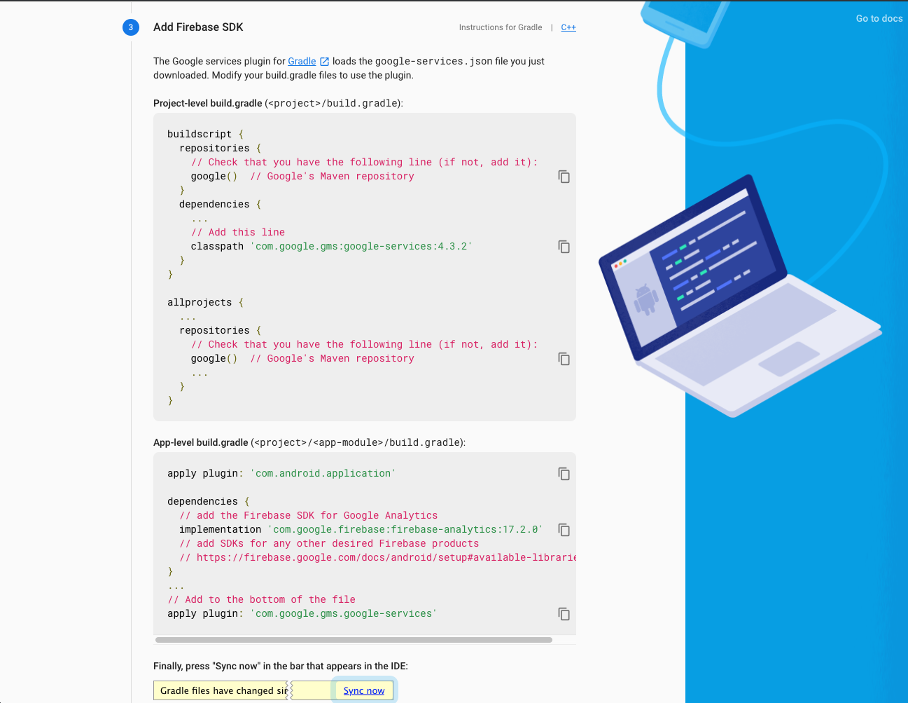

# Firebase Android Integration

In this document, we are going to add firebase to Android app.

First of all, go to [firebase console](https://console.firebase.google.com/). And follow the steps below.

1. In your `Firebase Dashboard` click the `Android Icon` :alien: on Banner. 

    

2. Complete the inputs and click the `Register App` button.

    

3. Download config file which name is `google-services.json`.

    

4. Add your `google-services.json` file under `yourApp > android > app` folder.

    

5. Add `Firebase SDK` to your app.

    

- Go to `yourApp > android > build.gradle` file.

    

    ```java
    buildscript {
        repositories {
            // Check that you have the following line (if not, add it):
            google()  // Google's Maven repository
        }
        dependencies {
            ...
            // Add this line
            classpath 'com.google.gms:google-services:4.3.2'
        }
    }

    allprojects {
        ...
        repositories {
            // Check that you have the following line (if not, add it):
            google()  // Google's Maven repository
            ...
        }
    }
    ```

- Next step of adding SDK. Open `yourApp > android > app > build.gradle` file.

    

    ```java
    apply plugin: 'com.android.application'

    dependencies {
    // add the Firebase SDK for Google Analytics
    implementation 'com.google.firebase:firebase-analytics:17.2.0'
    // add SDKs for any other desired Firebase products
    // https://firebase.google.com/docs/android/setup#available-libraries
    }
    ...
    // Add to the bottom of the file
    apply plugin: 'com.google.gms.google-services'
    ```

- After implementation. In your `Android Studio` sync your project.

6. Run your app. After complete the verification click to `Continue to Console` button.

    

7. Your app added to Firebase successfully!

    
