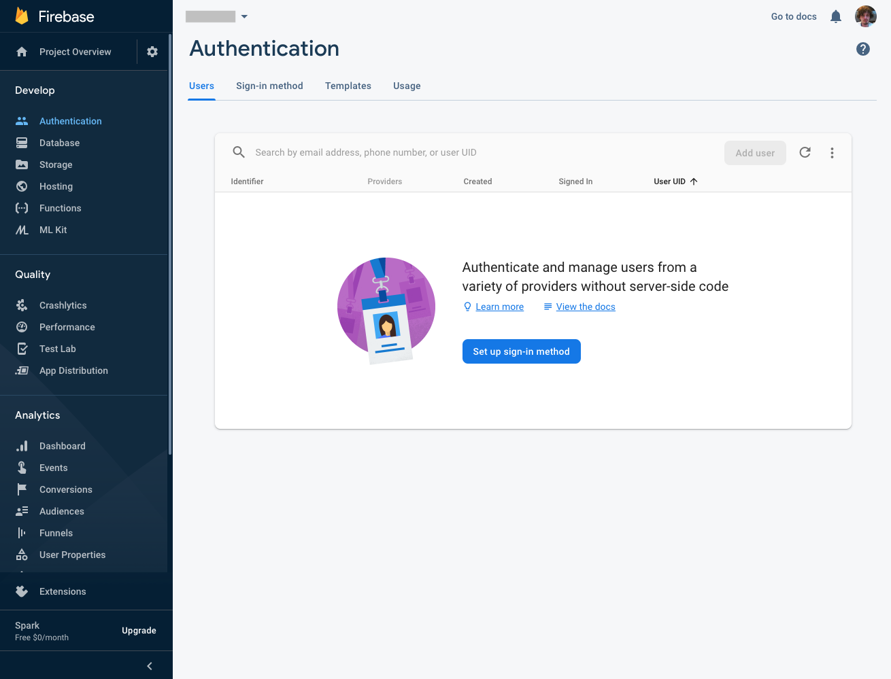
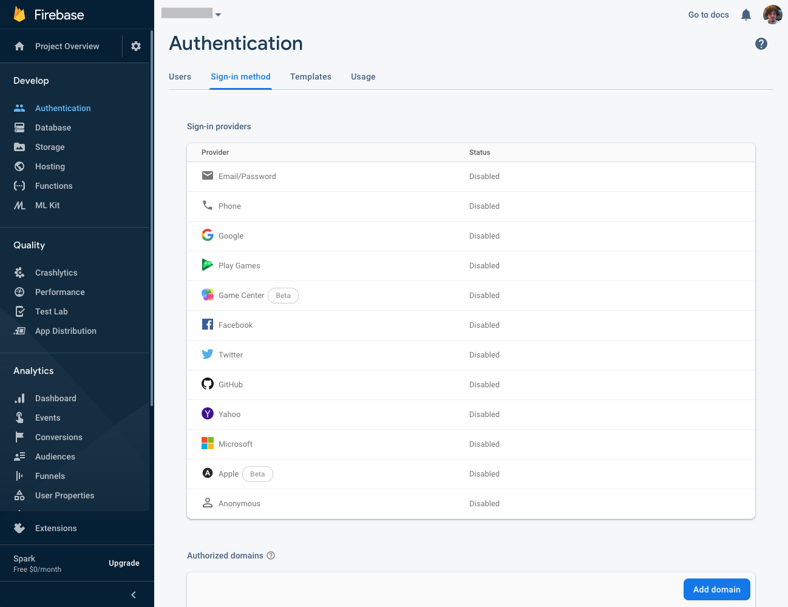

# Firebase Authentication

In this document, we are going to setup Firebase Authentication.

## Why Firebase Authentication?
Firebase is simple for Authentication so that you don't have to waste your time with other authentication ways.

## Setting Up Firebase Authentication

1. Firstly, go to your [firebase console](https://console.firebase.google.com/). 

2. On your `Firebase Dashboard` click the button on navigation which name is `Authentication`.

3. Click the `Set up sign-in method` button on Authentication dashboard.

    

4. Select one or more `Sign-in method` for Authentication.

    