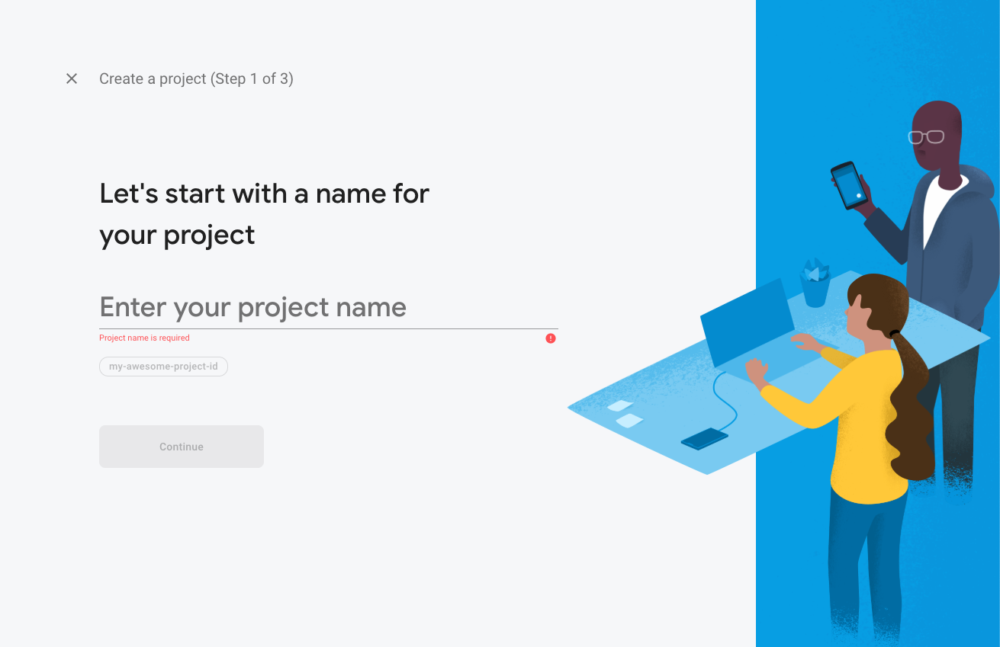

# Creating a new Firebase Project

Firebase is a technology which gives you a lot of features for develop your mobile and web apps. 
## Why we need Firebase?
Firebase is the most used platform for mobile app development. It is especially geared towards business apps, with the intention of helping businesses grow their user bases and increase their profits through their mobile apps. The best features of Firebase is the Analytics dashboard that it comes integrated with.

1. `Go to Firebase console` wtih this [link](https://console.firebase.google.com).

2. Click to `Create a project` button as you see below.

    

3. Enter your project name and click to `Continue` button.

    

4. Google Analytics for your Firebase project screen will appear. If you want to see statics `enable` google analytics. And click the `Continue` button.

    > Note: We are going to use this feature, so that we checked it.

    

5. In creating step 3, we have to `Configure Google Analytics`. If you have an account just select it and click the `Create Project` button. Well, ıf you don't have an Google Analytics account, you should create a new one.

    

6. Just wait a moment while creating your firebase project.

    

7. Your project created successfully!

    

8. Dashboard is ready for now!

    
