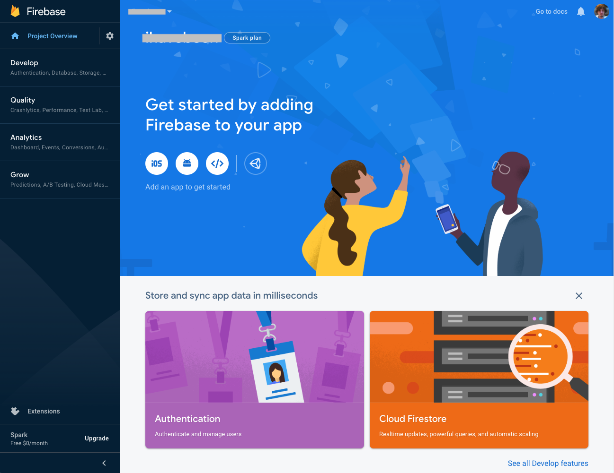
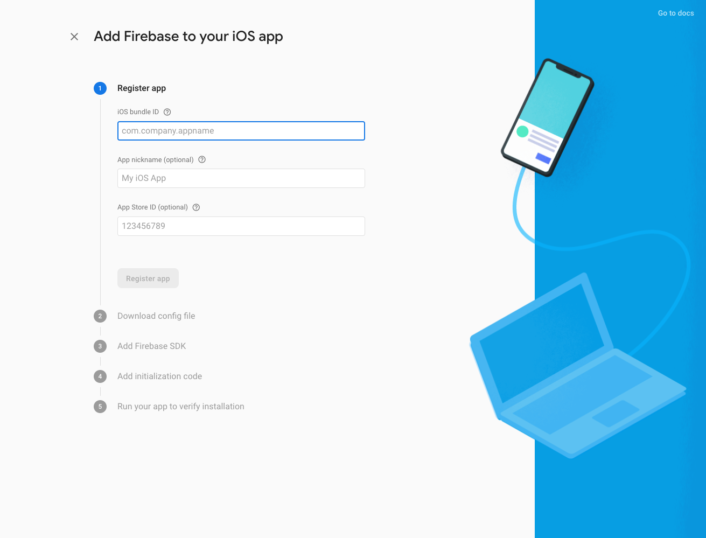
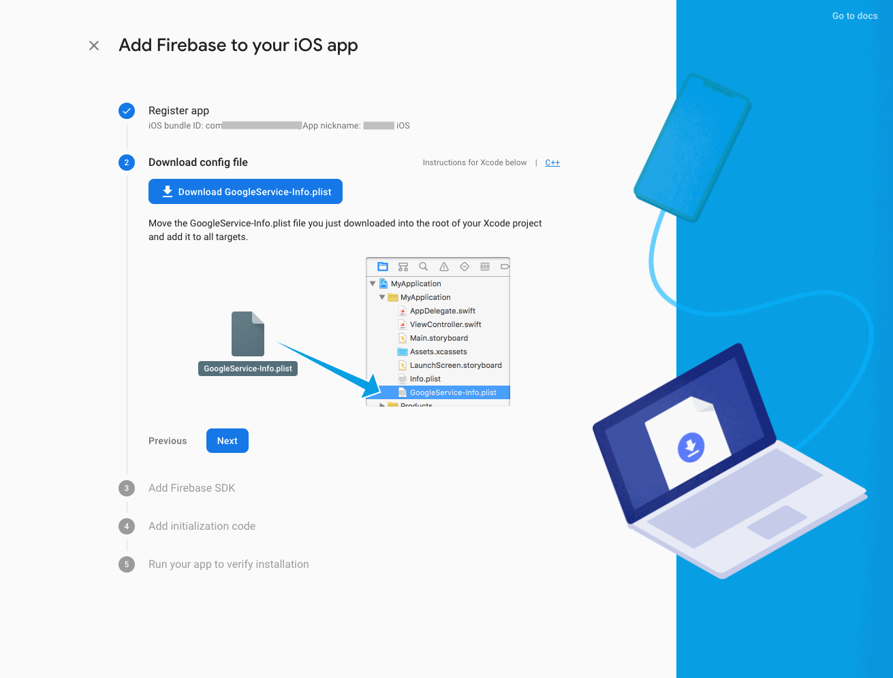
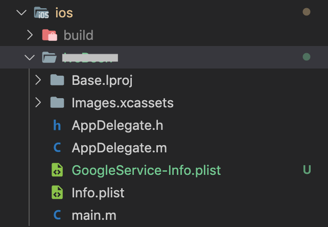
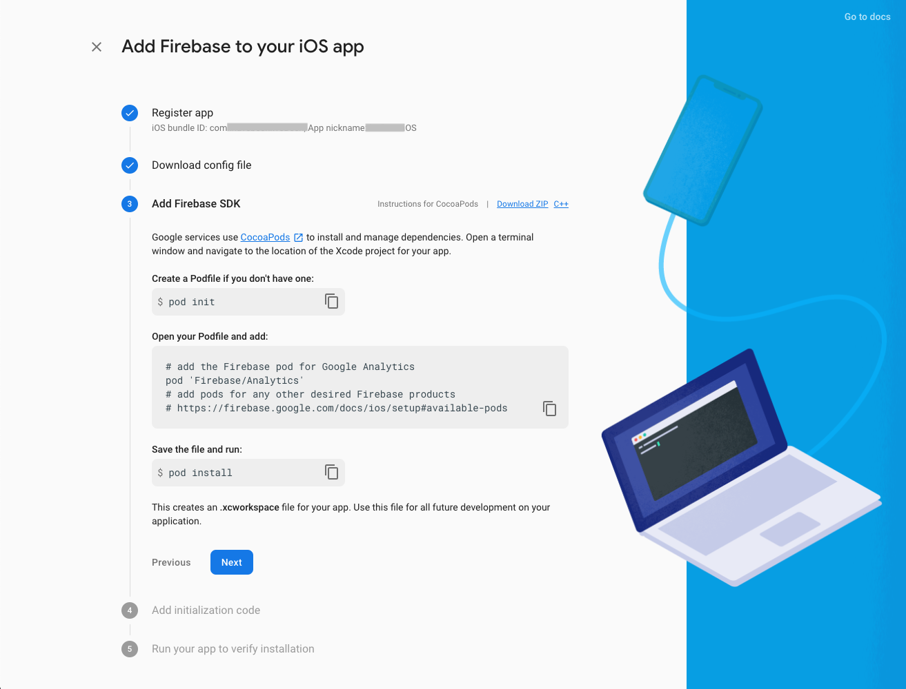
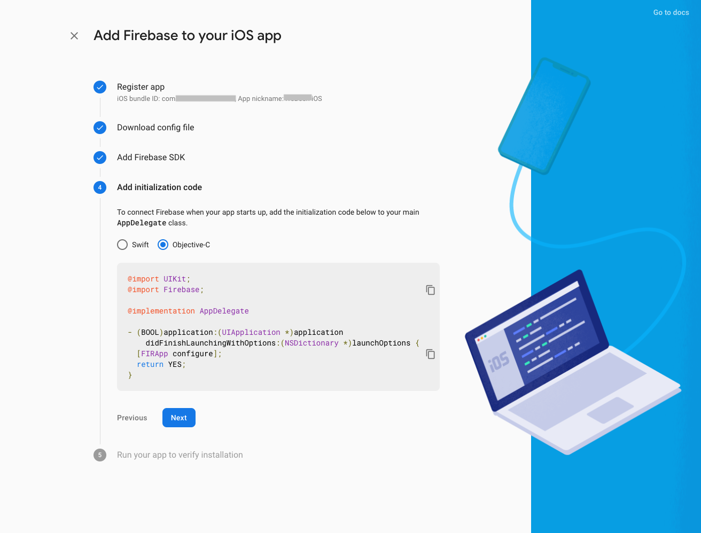
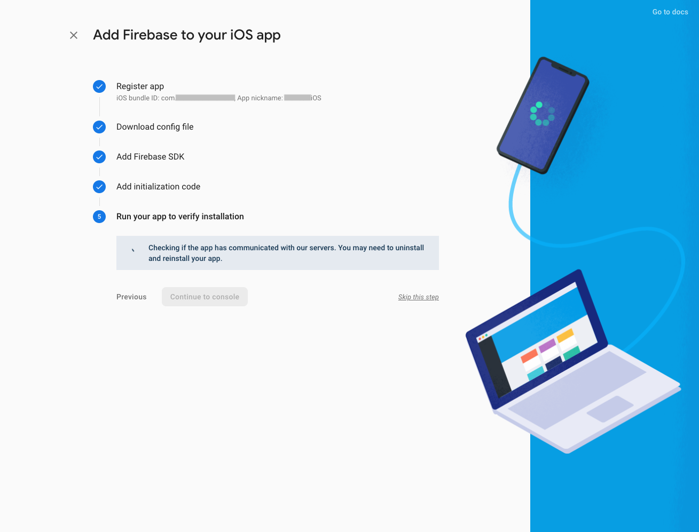
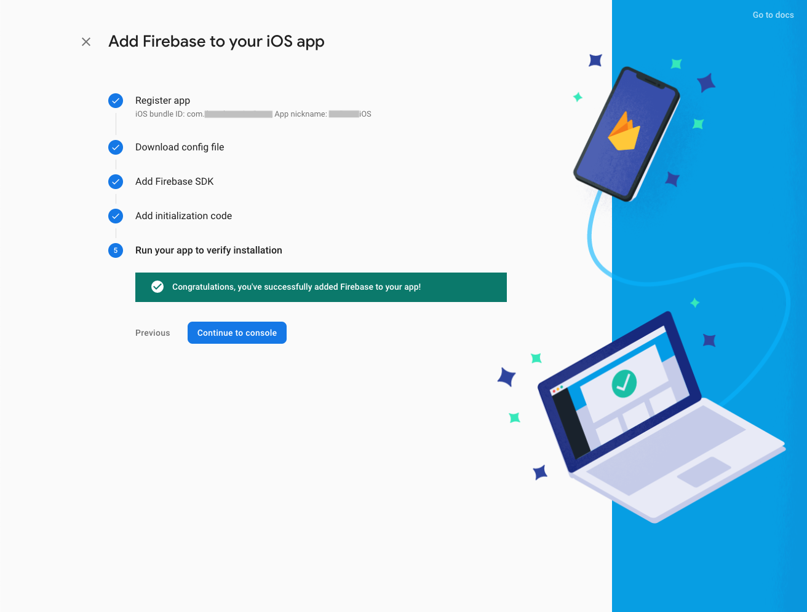
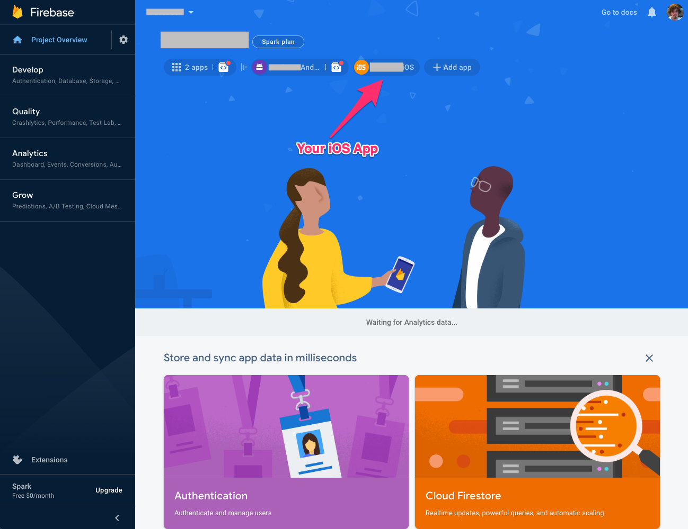

# Firebase iOS Integration

In this document, we are going to add firebase to iOS app.

First of all, go to [firebase console](https://console.firebase.google.com/). And follow the steps below.

1. In your `Firebase Dashboard` click the `iOS Icon` on Banner. 

    

2. Complete the inputs and click the `Register App` button.

    

3. Download config file which name is `GoogleService-Info.plist`.

    

4. Add your `GoogleService-Info.plist` file under `yourApp > ios > yourAppName` folder.

    

5. Add `Firebase SDK` to your app.

    

- Go to `yourApp > ios > Podfile` file.

    ```java
    pod 'Firebase/Analytics'
    ```

- Next step of adding SDK. In your terminal `cd ios` and `pod install`.

6. Add initialization code.

    

- In your `appDelegate.m` file add Firebase.

    ```javaScript
    @import UIKit;
    @import Firebase;

    @implementation AppDelegate

    - (BOOL)application:(UIApplication *)application
        didFinishLaunchingWithOptions:(NSDictionary *)launchOptions {
    // Firebase Integration: Start
        [FIRApp configure];
    // Firebase Integration: End

        return YES;
    }
    ```

7. Run your app. Wait for verification.

    

8. Run your app. After complete the verification click to `Continue to Console` button.

    

9. Your app added to Firebase successfully!

    
