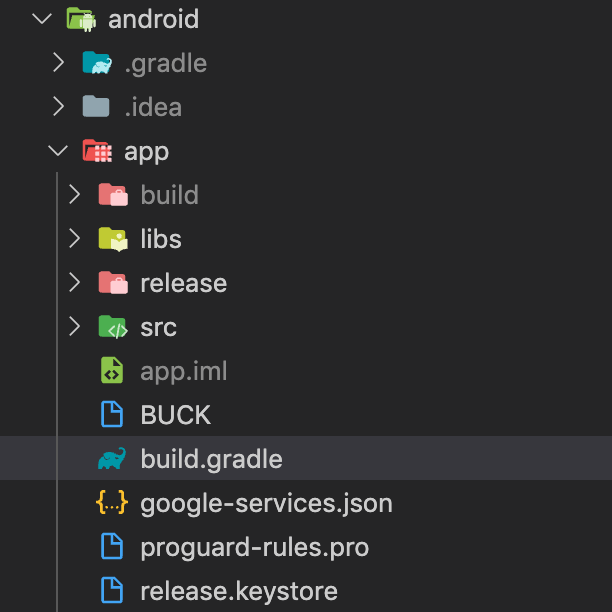

# Fresco Nedir?

Fresco, facebook tarafından 2015 yılında geliştirilmiş ve tamamen açık kaynak olarak sunulan, image ve giflerin oynatılmasını sağlayan bir Android kütüphanesidir. 

## Neden Geliştirildi?

Facebook mühendisleri `News Feed(Haber Kaynağı)` ekranında gösterilen resimlerin daha hızlı ve çözünürlüğü bozulmadan yüklemekte problemler yaşıyorlardı. Buna ek olarak resimlerin çözünürlüklerinin yüksek olması otomatik olarak Android cihazlarda ki `RAM yetmezliğine` neden oluyordu. Bunun üzerine Facebook mühendisleri `Fresco` kütüphanesini yazmaya karar verdiler. Ve Mart 2015 tarihinde, `Android 2.3(GingerBread) ve üzerini` destekleyen image kütüphanesi [Fresco](https://engineering.fb.com/android/introducing-fresco-a-new-image-library-for-android/) doğdu.


Fresco özünde, resimleri kendi yöntemiyle cacheleyerek, memory problemlerini önlemeye çalışıyor. Web sayfalarındaki lazy loading yapısına çok benzer bir şekilde, sadece görüntülenen görselleri arayüze yükleyerek bellek şişmesini engelliyor.

Bütün bunlara ek olarak, load mekanizması için çeşitli propertyler set edebilirsiniz. Bunun yanında görsel öğeler için Scaling, Placeholder, Rotation, Resizing gibi bir çok özelliği de kullanabilirsiniz.

## Fresco Nasıl Kullanılır?

Fresco'yu Android uygulamamıza entegre etmek ile başlayalım ve daha sonra nasıl aktif edip, kullanabilirsiniz görelim.

1. Android Uygulamamızın `App -> android -> app` dizini altında bulunan `build.gradle` dosyasını açalım.



2. `Build.gradle` dosyamızda bulunan `dependencies` kısmına aşağıdaki gibi Fresco'yu ekleyelim.

```java
dependencies {
  // Fresco Kütüphanesi
  compile 'com.facebook.fresco:fresco:1.14.2'
}
```

> Not: React Native uygulamalarında sadece fresco'yu `build.gradle` dosyasına eklemek yeterlidir. Bu adımdan sonra Android Native olarak devam etmektedir.

3. Kütüphaneyi ekledikten sonra initalize etmeniz gerekiyor. `MainApplication.java` dosyanızın altında onCreate metodunda, `super.OnCreate();` satırının altında `Fresco.initialize(this);` satırını aşağıdaki gibi ekleyerek initialize işlemini tamamlıyoruz. Artık Fresco'nun cache yöntemlerini kullanmaya başlayabiliriz.

```java
public class MyApplication extends Application {
    @Override
    public void onCreate() {
        super.onCreate();
        Fresco.initialize(this);
    }
}
```

4. Artık Android ekranlarınızın `layout.xml` dosyalarında `imageView` yerine `SimpleDraweeView` kullanmaya hazırız. 

```xml
<com.facebook.drawee.view.SimpleDraweeView
    android:id="@+id/myImage"
    android:layout_width="100dp"
    android:layout_height="100dp"/>
```

5. Uygulamanızı başlatın ve farkı sizde görün. Uygulamanızdaki resim yüklenme performansını fark edeceksiniz.

Kaynaklar:
- https://frescolib.org/
- https://engineering.fb.com/android/introducing-fresco-a-new-image-library-for-android/
- https://guides.codepath.com/android/displaying-images-with-the-fresco-library

Artık performanslı bir Android uygulaması deneyimine hazırsınız! 😃
Daha fazla story için lütfen takip edin ve alkışlarınızı esirgemeyin. 🙏