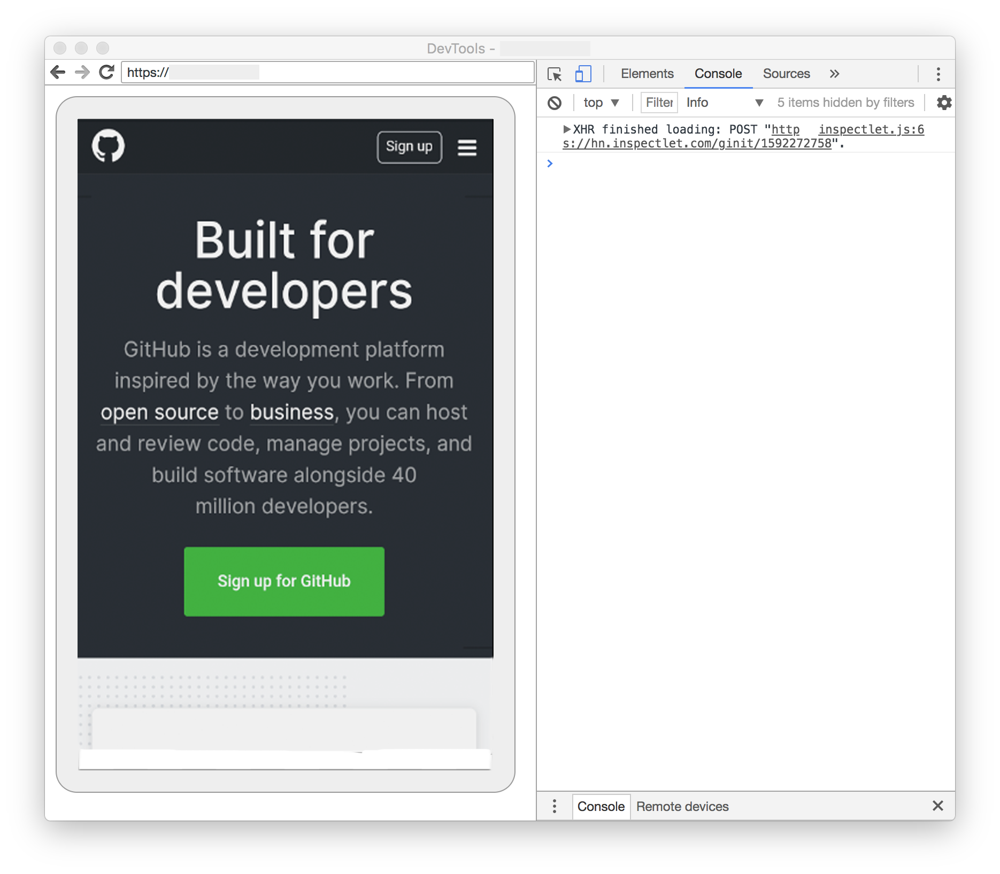

# Debugging React Native WebView

As you know, some of the applications used today are still web-based and with the spread of mobile applications, developers use webview applications to meet the needs of users. Therefore we will examine how to debug a react-native application that uses webview. 

Debugging webview on iOS and Android devices is a bit different and laborious. So we will examine two different platforms respectively. Let's look at `iOS` platform first.

## iOS Platform
Webview, uses `Safari` browser on iOS operating system. In this way, it loads web pages. While debugging, we will use the safari application of our MacOs computer. For debbugging Webview contents in iOS simulator.

1. Open Safari application.
2. In Safari `Preferences`, click the `Advanced` tab. Enable checkbox "Show Develop menu in menu bar" at the bottom.
3. Start react-native app in iOS Simulator or device. Open webview screen on your app.
4. In `Safari` of computer. `Safari -> Develop -> [device name] -> [app name] -> [url - title]`

> **Note:** Web debugging on device. You must activate `Web Inspector` in your device. <br/> `Settings -> Safari -> Advanced -> Web Inspector`

<br/>
<br/>

## Android Platform
In Android, webview is uses `Stock` or `Custom` browsers (Chrome, Samsung Internet etc.). Webview is debugging on `Chrome` browser of your computer. 
1. You will need to add this little code block to your `MainApplication.java` to enable webview debug.

```java
  import android.webkit.WebView;

  @Override
  public void onCreate() {
    super.onCreate();
	  ...
    WebView.setWebContentsDebuggingEnabled(true);
  }
```

2. After adding code, start your Android app.
3. Open Chrome browser. Follow these steps, `Chrome -> DevTools -> Menu (3 dots) -> More tools -> Remote devices`.
4. Select your Android device on the screen and select "Inspect" the webview page.

> **Note:**
When debugging on device you must enable USB debugging in your device settings.
`Settings -> System -> About Phone -> Developer options -> enable USB debugging`.



<br/>
<br/>
<br/>


# React Native WebView nasıl debug edilir?

Bildiğiniz üzere günümüzde kullanılan bazı uygulamalar halen web tabanlı olarak çalışmakta ve mobil uygulamaların yaygınlaşması ile birlikte kullanıcıların ihtiyaçlarını karşılamak amacıyla geliştiriciler webview uygulamalar kullanmakta. Bu sebeple webview kullanan bir react-native uygulaması nasıl debug edilir inceleyeceğiz. 

iOS ve Android cihazlarda webview debug biraz farklı ve zahmetlidir. Bu yüzden iki farklı platformu sırasıyla inceleyeceğiz. İlk olarak `iOS` platformuna bakalım.

## iOS Platformu
Webview browser olarak, iOS işletim sistemleri cihazlarda `Safari` kullanmaktadır. Bu sayede web sayfalarını yüklemektedir. Debug ederkende MacOsX bilgisayarımızın safari uygulamasını kullanacağız.

1. Bilgisayarınızdan `Safari` uygulamasını açın.
2. Safari'yi açtıktan sonra `Preferences`'a tıklayın ve açılan pencereden `Advanced` tabını seçin. Daha sonra en altta bulunan "Show Develop menu in menu bar" checkbox'ı işaretleyin.
3. iOS uygulamanızı başlatın ve webview sayfasını açın.
4. Safari açıkken yukarıdaki araç çubuğundan `Safari -> Develop -> [device name] -> [app name] -> [url - title]` seçiniz. Ve artık Debug etmeye hazırsınız.

> **Not:** Cihaz üzerinde debug etmek için `Web Inspector`'u aktif hale getirmeniz gerekmektedir. <br/> `Settings -> Safari -> Advanced -> Web Inspector`

<br/>
<br/>

## Android Platformu

Android işletim sisteminde webview default olarak android'in stock browserını kullanmaktadır veya custom browser'ı kullanır(Chrome, Samsung Internet vs.). Bilgisayarınızda Webview `Chrome` browser üzerinden debug edilir. 

1. İlk olarak aşağıdaki kod bloğunu `MainApplication.java` dosyasına eklemeniz gerekmektedir, çünkü debug edebilmek için Android cihazlarda aktif hale getirir.

```java
  import android.webkit.WebView;

  @Override
  public void onCreate() {
    super.onCreate();
	  ...
    WebView.setWebContentsDebuggingEnabled(true);
  }
```

2. Ekleme işlemi tammamlandıktan sonra Android uygulamanızı başlatın.
3. Chrome browser'ınızı açın. Ve şu adımları takip edin. `Chrome -> DevTools -> Menu (3 dots) -> More tools -> Remote devices`.
4. Android cihazını seçin ve "Inspect" butonuna basın. Artık Webview'ı debug etmeye hazırsınız.

> **Not:**
Cihaz üzerinde debug etmek için `USB Debugging`'i aktif etmeniz gerekmektedir. <br/>
`Settings -> System -> About Phone -> Developer options -> enable USB debugging`.

