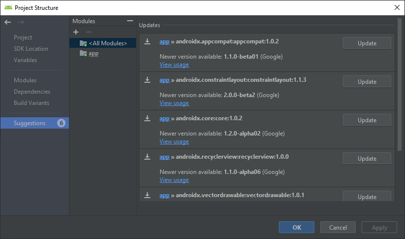

# Gradle Plugins Updates

Easy way to update gradle plugins and other suggestions. 

See `File > Project Structure`, then click `Suggestions`. I know, this solution was suggested by Hemant Sharma and Jeremías Gersicich, but Android Studio has changed it in 3.4.1 version.

<a href="https://stackoverflow.com/a/56836855/7626331">For more details...</a>