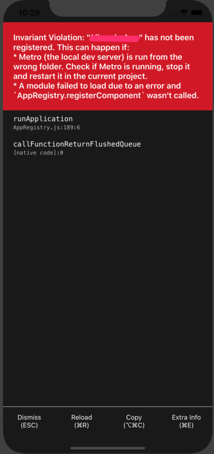

# "App" has not been registered

If you getting this error. You should check the app.json file.



```javascript
/**
 * @format
 */

import { AppRegistry } from 'react-native';
import App from './App';
import { name as appName } from './app.json';

AppRegistry.registerComponent(appName, () => App);

```

```json
{
  "name": "MyApp", // this must be same with the ios folder
  "displayName": "MyApp Mobil",
  "android": {
      "package": "com.keremcubuk.mobil"
  }
}
```

In Xcode11, project name and ios folder names must be same. If you didn't check this, you will get error.